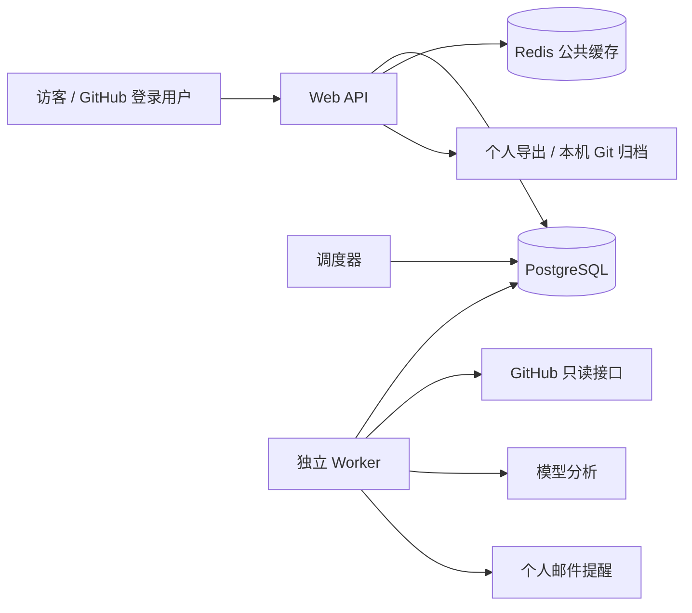

# Gitwire

> Your personal open-source intelligence desk · 一个人的开源情报站

Gitwire 是面向 GitHub 公开项目的个人情报站。你选择关注的仓库，系统持续观察 Issue、PR 和项目变化，分析参与难度、认领证据、架构与版本变化，生成个人警报和每日晨报。访客可以查询公开情报；登录只使用 GitHub，不需要注册独立账号或手动生成 Token。

托管服务只读取 GitHub，不创建或修改 Star、Issue、PR、源仓库或 GitHub 通知。分析结果保存在服务器，也可导出到本地；可选远端备份由用户使用本机 Git 凭证显式执行。

## 当前托管多用户版本

支持 GitHub 登录、Star / 自有公开仓库候选、个人监控规则、Issue 雷达、档案版本对比、日报、邮件提醒和本地归档。PostgreSQL 保存用户隔离的数据和持久任务，Redis 仅作可重建的公开缓存，Worker 与调度器独立运行。具体验收证据见 [PLAN.md 第 12 节](PLAN.md#12-托管多用户升级2026-10-04当前执行计划)。

请使用 [托管版本本地指南](docs/hosted-local.md) 启动和测试；Docker 托管部署见 [部署指南](docs/deploy-cloud.md)。本地邮件投递到 Mailpit；外发邮件和公网部署需要另外配置 SMTP、域名与 HTTPS。

```bash
uv run python scripts/acceptance.py up
uv run python scripts/acceptance.py status
uv run gitwire ops-status
```

访问 http://127.0.0.1:10241 。托管服务只读取 GitHub；情报远程备份必须由用户在本机显式运行归档命令。



<details>
<summary>旧单用户版本参考（以下为历史设计，不适用于当前托管服务）</summary>

## 旧单用户版本快速开始

```bash
# 1. 配置
cp .env.example .env        # 填 GITWIRE_VAULT / GITHUB_TOKEN / LLM_*

# 2. 旧版仅按单用户配置本地运行；根目录 Compose 已切换为托管模式
# 运行旧版需在 .env 明确设置 HOSTED_ENABLED=false
uv sync
npm --prefix frontend install && npm --prefix frontend run build
uv run gitwire serve        # http://127.0.0.1:10240
```

不想起 Web，CLI 直接用：

```bash
uv run gitwire sync --repo owner/name   # 手动同步一个仓库（建档/增量）
uv run gitwire watch                    # 跑一轮扫描并把队列跑干
uv run gitwire daily                    # 生成昨日晨报
```

开发模式：后端 `uv run gitwire serve`，前端 `npm --prefix frontend run dev`（10241 端口，代理 /api）。

## 架构与需求

- 开发契约见 [PLAN.md](./PLAN.md)：需求澄清结论、配置设计、核心流程、验收标准
- 云端部署见 [docs/deploy-cloud.md](./docs/deploy-cloud.md)

```
React SPA ──▶ FastAPI 单进程
              ├─ 调度器（每小时 Watch + 每日 08:00 晨报）
              ├─ 分析器（建档=clone 深读 / 增量=diff API，OpenAI 兼容接口）
              └─ 发布器（vault git commit/push + 态势板）
vault 仓库（档案 + 游标 + 晨报）= 情报产出；系统配置 gitwire.yml 在本地 `data/`，不入库
SQLite = 运行台账（runs / logs）
```

## 情报产出

本仓库是 Gitwire **软件本体**；情报档案发布在独立仓库 [czm233/gitwire-vault](https://github.com/czm233/gitwire-vault)——每个被监控项目一个文件夹，内含技术栈、架构图、业务逻辑、changelog、哨兵记录与同步游标（`meta.yml`）。

## 它解决什么问题

- 每次想了解一个开源项目，都得临时问 AI，又慢又没有积累
- 代码一提交，手上那份架构 / 流程文档就过时了
- 自己在意的功能悄悄上线了、依赖的库出 CVE 了，总是后知后觉

## 核心循环

```
Watch（扫描游标） → Analyze（配方分析） → Publish（发布分发）
```

- **Watch**：定时扫描（默认每小时），只记录各项目 main 分支最新 SHA，便宜且无状态
- **Analyze**：游标前进才触发分析；首次全量建档（clone 深读），此后按累计 diff 增量更新
- **Publish**：产出写入独立情报仓库（配置与游标也存放于此），提交前缀 `[owner/repo]`

## 情报产品

| 类型 | 产出 |
|---|---|
| 档案 dossier | 技术栈清单 / 架构图 / 业务逻辑（mermaid 时序图 + 流程图） |
| 简报 brief | 每次同步一份 changelog：新增 / 修复 / 重构 / 破坏性变更 |
| 晨报 daily digest | 每日跨项目变化汇总，一页读完 |
| 警报 alert | 哨兵（tripwire）判决翻转、破坏性变更、CVE → Bark 推送（v1） |

## 设计原则

- **编排归代码，语义归 agent**：扫描 / 队列 / 游标 / 发布是确定性代码，分析与写作交给 agent 配方
- **配置与产出分离**：`gitwire.yml` 存本地 `data/`（.gitignore 已忽略，永不入情报仓库）；
  vault 只存情报产出与 `meta.yml` 游标（游标随产出提交，保证「发布成功游标才前进」的原子性）
- **情报写作规范**：结论先行（BLUF）、分层抽象（摘要 → 详情 → 原始 diff）、标注信源与时效（repo + SHA + 时间）

## 路线图

- [x] v0：扫描器 + 游标 + `docs-sync` 配方 + 独立情报仓库发布 + 态势板 + Web UI + 变更时间线 + 每日晨报
- [x] v1：多配方（`feature-tripwire` 哨兵 / `bug-watch` 缺陷观察）+ Bark 推送 + SSE 实时进度 + Obsidian frontmatter
- [x] v2：release / issue / CVE（OSV）触发、推回自有仓库的 PR 模式
- [x] v3：`issue-radar` issue 雷达（机会发现 / 被占检测 / 难度分析，服务 OSS 贡献决策）
- [x] v4：issue 监控重做——雷达 v2（强信号被占 + 口认领 + 机会池动态 + 机会榜排序）、
  issue 追踪（`repos[].watch_issues`，新评论/状态/标签 → `watch` 警报）、晨报 issue 风向小节

## 配方（recipes）

| 配方 | 产出 | 触发 | 警报 |
|---|---|---|---|
| `docs-sync` | 档案 + changelog | 游标前进（建档/增量） | — |
| `feature-tripwire` | `tripwires.md` 哨兵清单与判决 | 增量时挂载 | 判定翻转 |
| `bug-watch` | `bugwatch.md` 缺陷修复与影响 | 增量时挂载 | 破坏性变更 |
| `cve-scan` | `security.md` 依赖漏洞（OSV，零 LLM） | 建档 / 依赖清单变更 | 新增 CVE |
| `issue-radar` | `issues.md` issue 雷达：机会榜（难度×新鲜度×help 标签×讨论热度）/ 池内动态 / 被占 / 近期关闭 | 新 issue、新 PR、机会池动态、首挂载全量盘点 | 参与机会 / 机会被占 / 机会了结 |
| 追踪 watchlist | `watched.md` 追踪 issue 的状态与新评论原文（零 LLM） | 追踪 issue 任何动态 | `watch` |
| release-brief | `releases/<tag>.md` 版本简报 | 新 release（自动） | 新版本 |

**issue 雷达 v2** 为 OSS 贡献者设计：新 issue 无人认领且无 PR 强引用（fixes/closes）→ AI 判难度（简单/中等/困难）+
问题分析 + 方案评估，入机会榜（确定性打分排序）；机会池持续追踪——口认领检测（读新增评论识别「我在做」）、
标签升温、评论激增、占坑 PR 关闭回流、issue 被关闭（记录被谁解决）。**追踪**（`repos[].watch_issues`）
把你点名的 issue 纳入监控，任何动态推 `watch` 警报并留评论原文。
Gitwire 只做情报分析，参不参与、怎么参与由你自己决定。

配方在本地 `data/gitwire.yml` 里按仓库挂载（`repos[].recipes`），
`publish_mode: pr` 时同步内容走 Pull Request 人工审核后合入。监控即盯整个仓库，无路径过滤。

机会榜硬条件同样在 `gitwire.yml`（顶层 `opportunity`，`repos[].opportunity` 可按仓库覆盖，数值 `0` 关闭该条）：
`difficulties` 入榜难度 / `max_age_days` 超龄且近 14 天无动静 / `max_comments` 讨论过热 /
`repo_pushed_within_days` 仓库活跃 / `external_merge_within_days` 近期合并过外部贡献者的 PR——
不满足的 issue 归入「未入榜」并逐条标注原因，机会榜与机会警报只对通过者生效。

追踪切换/配方编辑/发布模式等一切配置操作只写本地 `data/gitwire.yml`，毫秒级生效；
配置不入情报仓库，永不产生 git 提交（存量配置由启动迁移自动搬出）。

---

✅ v0–v4 已实现：React 态势板 + FastAPI 引擎 + 雷达 v2/追踪 + 六配方 + 警报（Bark）+ SSE + PR 模式 + Docker 单容器。

</details>
