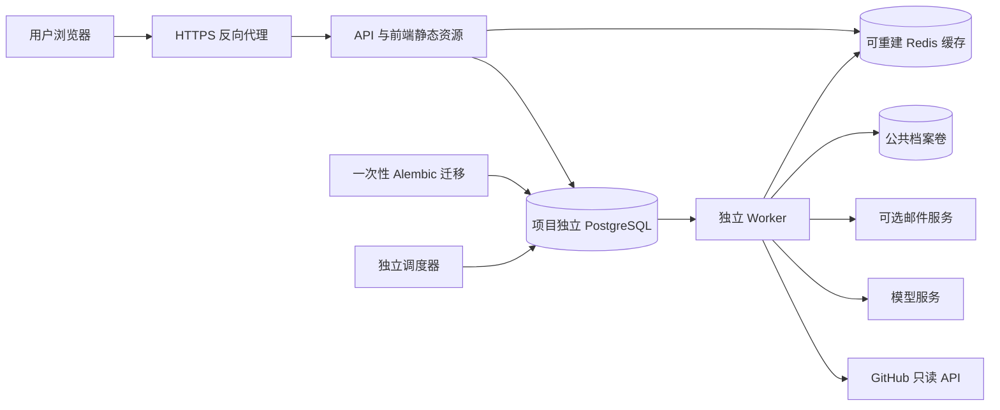

# 托管多用户部署

当前托管模式由 API、Worker、调度器、PostgreSQL 和 Redis 组成。登录仅使用 GitHub App，公开查询不需登录；个人监控和提醒隔离。旧版的访问密码、SQLite 单进程调度、服务器自动推送情报仓库不适用于本指南。

本机开发继续使用 [本地验收指南](hosted-local.md) 的 `scripts/acceptance.py`，不要把生产 Compose 接到开发数据卷。默认生产资源组为 `gitwire-deploy`，数据库和源码/配方目录使用独立命名卷；数据库和 Redis 不向宿主机发布端口。

## 首次配置

在准备部署的机器上初始化一次：

```bash
uv run python scripts/init_production_env.py
```

它从 `.env.production.example` 创建权限 0600 的 `.env.production`，生成数据库密码、Fernet 密钥及邮件回执 HMAC 密钥。已有文件时拒绝覆盖。保存并备份这些值；重复生成加密密钥会使既有 OAuth 凭证与邮件正文无法解密。

编辑 `.env.production`，填写：

| 配置 | 用途 |
|---|---|
| `PUBLIC_URL` | 用户实际访问的 HTTPS 域名，如 `https://gitwire.example.com`；不能使用示例域名上线 |
| `GITHUB_CLIENT_ID` / `GITHUB_CLIENT_SECRET` | 对应该域名的 GitHub App；回调为 `PUBLIC_URL/api/auth/github/callback`，关闭 Webhook，账户 Starring 只读 |
| `LLM_*` | 部署方提供的分析模型地址、密钥和模型名；匿名查询不触发模型 |
| `SMTP_*` / `MAIL_FROM` | 可选的真实邮件服务；未配置时不能宣称外发邮件可用 |
| `GITHUB_TOKEN` | 可选的平台公共 API 读取额度；普通用户不需要生成 Token，应用不使用此值写 GitHub |
| `SOURCE_CLONE_*` / `MODEL_*_LIMIT` | 源码采集与模型预算，默认值见示例 |

`GITWIRE_DB_PASSWORD` 默认生成十六进制值，适合 Compose 内部数据库连接串；不要未经编码直接替换成带 URI 保留字符的密码。更换真实 GitHub、邮件或模型密钥后需重建相应应用容器，不要只刷新浏览器。

## 启动

本项目登记的宿主端口为 10240。先确认归属；当前本机的开发后端也使用此端口，不能同时启动生产 API。API 只绑定 `127.0.0.1:10240`，由你已有的 HTTPS 反向代理转发；代理配置须保留请求 Host、Cookie 和原始协议。外部服务提供商、DNS 与 HTTPS 证书需在目标环境验证。

```bash
docker compose --env-file .env.production config --quiet
docker compose --env-file .env.production up -d --build --wait
docker compose --env-file .env.production ps --all
curl --fail http://127.0.0.1:10240/api/health
```

启动先等待独立 PostgreSQL 健康，再执行 Alembic 全部迁移；迁移成功后才启动 API。Worker 等 API 健康后启动，调度器最后启动。镜像包含前端构建产物、迁移文件和配方资源，以非 root 用户运行。Docker 构建上下文使用白名单，不包含 `.env`、真实数据、源码缓存或本机依赖。



`/api/health` 验证数据库、Redis 连通性与登录配置存在性，不代表外部 GitHub 授权、模型、SMTP 或定时任务链路全部成功。上线验收还须实际完成登录、Star 同步、选择监控、分析任务和邮件收件；不要把容器 Running 当作业务完成。

## 队列与定时服务观测

在服务环境运行 `gitwire ops-status`；本机开发使用 `uv run gitwire ops-status`，生产使用：

```bash
docker compose --env-file .env.production exec api gitwire ops-status
```

输出仅有聚合计数：Worker / 调度器心跳距今秒数、维护排空状态、可执行任务数及最久等待秒数、延期任务数、过期租约、按任务类型/状态分组的数量及邮件状态数量。此命令只供具有服务器访问权限的运维人员使用，没有公开 HTTP 入口，也不输出用户 ID、邮箱、任务正文或凭证。

Worker 每 15 秒更新心跳，调度器每 30 秒更新，90 秒内为 recent。心跳代表至少一个对应角色的循环仍运行，不保证每个副本或每项任务健康。应一起观察可执行积压年龄、过期租约和失败计数；额度导致的延期与可执行积压分别计数。维护排空期间心跳过期可能是预期状态。

每小时投递一次有界清理任务，每类最多清理 500 条：过期超过 1 小时的登录尝试、浏览器会话和邮箱验证，7 天未更新的公共 HTTP 缓存，过期超过 1 天的限额计数。排空恢复标记、业务历史、日报、候选、已完成同步任务和邮件台账均保留，避免破坏日报依赖或恢复能力。大量旧记录会分批清除；业务数据的长期保留周期另由运营方制定。

## 升级与恢复

先备份，再停止调度器和 Worker。Worker 收到 SIGTERM / SIGINT 后不再领取新任务，等待当前任务结束；Compose 留出 31 分钟，任务自身上限为 30 分钟。不要在尚有分析运行时手动强杀。

```bash
# 先生成可恢复备份，再执行以下升级操作
docker compose --env-file .env.production stop scheduler worker api
docker compose --env-file .env.production build
docker compose --env-file .env.production run --rm migrate
docker compose --env-file .env.production up -d --wait
```

数据库是任务、账户和邮件 outbox 的权威来源；中断任务在租约到期后重领，Redis 丢失不应丢失任务。源码采集取消会清理 Git 进程组及其临时目录；首次采集仅下载指定提交，不检出、不执行源码。默认 120 秒、200 MiB 目录检查，超限会改用同一提交的关键文件样本；目录上限为 250 ms 轮询检查，短时可能超出，生产磁盘配额仍由运行环境负责。

备份须同时覆盖：

- PostgreSQL：用户、监控、OAuth 密文、公开分析、历史版本、日报、任务和邮件。
- `public-corpus` 卷：配方的本地 Git 历史、游标和台账；数据库已保存展示文档，但此卷影响后续增量分析和事件恢复。
- `.env.production` 中的加密密钥：与数据库备份分开保护。不要上传到代码仓库。

恢复时先停应用、恢复 PostgreSQL 和配方卷、配置原加密密钥，再运行迁移和启动。不要用 `down --volumes` 做日常停机；它会删除命名数据卷。部署环境应使用自己的定期备份、保留周期和恢复演练；本地 `backup_local.py` 只针对开发资源组，不能拿它替生产备份。

真实邮件还需要 TLS、发信域名 SPF/DKIM、退信回执适配和 HTTPS 退订验证，详见 [邮件说明](hosted-local.md#退订投递记录与退信回执)。SMTP 接收不等于到达收件箱，稳定 Message-ID 也不是严格一次投递保证。

## 本机镜像验收

可用不含真实 OAuth/模型/邮箱凭证的临时资源组测试整套 Compose：

```bash
docker build -t gitwire:hosted .
uv run python scripts/acceptance_container.py up
uv run python scripts/acceptance_container.py status
# 验证完后清除该脚本独占的临时容器和测试卷
uv run python scripts/acceptance_container.py down
```

入口为 `http://127.0.0.1:10242`，已登记且启动前检查端口。测试组名固定为 `gitwire-acceptance-deploy`，不复用开发或生产数据库，不导入真实账号。测试环境的 GitHub 登录显示“待配置”是预期；真实 OAuth 仍在本机开发入口 10241 验收。
