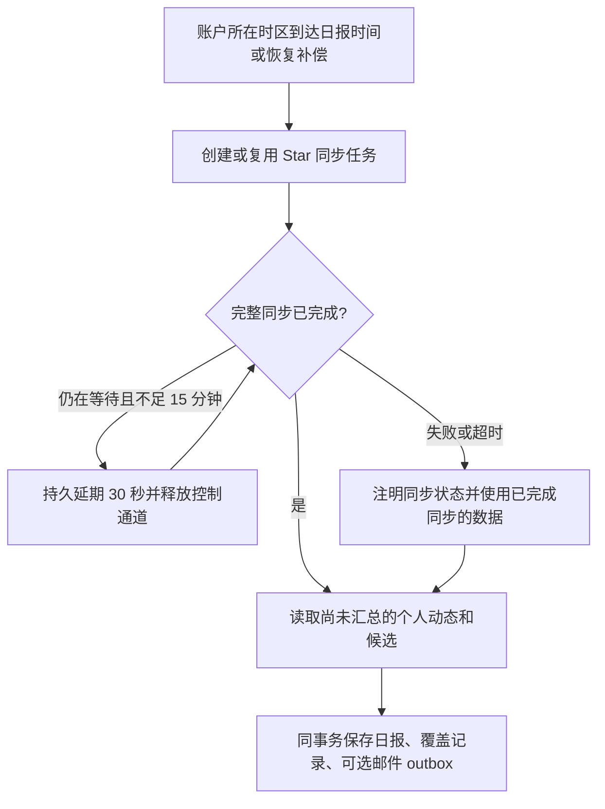
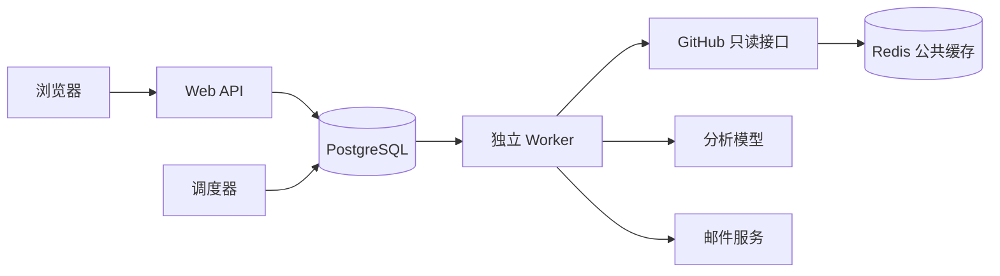

# 托管版本本地开发与验收

本版本以 GitHub 身份作为唯一账户入口。公开语料和通用分析共享，个人监控、提醒、日报、邮箱和授权彼此隔离。访客可查询公开项目；登录后才能保存监控。源仓库、Star、Issue、PR 和 GitHub 通知均不写入。

## 本机环境

Gitwire 使用登记的 10240–10249 号段。前后端为 10240 / 10241，独立 PostgreSQL 为 10243，Redis 为 10244，本地邮件 SMTP 为 10245，Mailpit 收件箱为 http://127.0.0.1:10246 。启动前脚本读取本机端口登记表，并检查监听进程的工作目录。

首次配置使用 `.env.example` 和 `.env.infra.example`；真实 `.env`、`.env.infra` 不入 Git。数据库密码必须一致；`ENCRYPTION_KEY` 是 Fernet 密钥，用于加密 GitHub Token 和邮件正文。密钥应单独安全备份，不能在每次启动时重新生成。

GitHub App 填写主页 `http://127.0.0.1:10241`，回调 `http://127.0.0.1:10241/api/auth/github/callback`，关闭 Webhook，只申请账户 Starring 只读权限。Client ID 和 Client Secret 写入服务端 `.env`；App ID 和私钥不用于本次用户登录。

```bash
uv sync
npm --prefix frontend install
uv run python scripts/acceptance.py up
uv run python scripts/acceptance.py status
uv run gitwire ops-status
```

`.env` 变更后执行 `uv run python scripts/acceptance.py restart`。服务分别运行于项目自己的 tmux 会话：Web、前端、worker、scheduler。`down` 只停止开发进程，保留数据库容器和卷。不要在有重要分析任务运行时重启；意外中断的任务会在租约过期后恢复。

## 执行与缓存

PostgreSQL 是任务、同步游标和邮件 outbox 的持久来源。Worker 将调度/邮件、GitHub 同步、模型任务分为三个执行通道。租约保护任务归属，失联任务可重领；额度耗尽和免打扰等待不会消耗失败重试次数。普通失败指数退避，达到上限后保留失败记录。

Star 和 Issue 同步按页保存进度，成功完成全轮后更新增量游标或缺失状态。取消 Star 只影响候选列表，不撤销用户已选择的监控；重新 Star 也不会清除忽略设置。初次盘点的历史 Issue 可见，但不作为“刚出现的新机会”群发提醒。

## 日报、Star 同步与停机补偿

日报按账户时区和设置小时触发，先发起或复用本人的 Star 同步，再生成正文。同步等待通过持久任务延期实现，不占住控制 Worker；获取“我的仓库”的任务不会被误当成 Star 同步。GitHub 未连接、同步失败或等待超过 15 分钟时，日报仍会生成并注明原因，只使用已完成整轮同步的候选，不把半轮结果当成完整检查。

日报记录本次实际汇总起止时间，以及每条通知、候选已进入哪份日报。上次之后新增及延迟到达的记录都会被纳入，已汇总内容不重复；忽略或已取消 Star 的候选不展示。当天晨报前同步到的新 Star 可以出现在当天晨报，不必再等一天。过期或延迟的候选同步完成后，尚未汇总的候选会在后续日报补入。

服务恢复时补最近一个已到时间的日报，把尚未汇总的动态合在一起，不按停机天数发送一批旧邮件。即使恢复发生在今天的设置小时之前，也会检查昨天是否漏发。数据库按用户锁定日报生成，同一天最多保存一份日报和一封对应 outbox 邮件；更早的滞后任务不能把完成日期回退。旧日报迁移保留原来“前一个自然日”的覆盖范围，后续使用实际完成时间衔接。



运维清理任务时须保留未汇总候选所引用的完成同步任务，以及活跃日报的 `star_job_id` 依赖。候选是否来自完整同步依据持久任务状态，不能只凭“页面已有若干行”判断同步成功。

后台每小时分批清理过期登录尝试、会话、邮箱验证、旧公共 HTTP 缓存和过期限额；不清理业务历史与已完成任务。`ops-status` 提供后台心跳、可执行积压年龄、延期数量及过期租约，具体含义见[运维说明](deploy-cloud.md#队列与定时服务观测)。

公开 GitHub 响应使用 30 秒 Redis 热缓存和 PostgreSQL ETag 条件请求；读取热缓存前仍检查仓库公开状态。账户接口不进入公开缓存。Redis 停机可回退到数据库/API。列表在数据库分页。AI 调用设有用户、仓库与平台额度，访客查询不会触发新的模型分析。



## 邮件验收

当前 SMTP 指向本地 Mailpit，不会发送给真实外部邮箱。可在设置中填写明显的测试邮箱，发送验证邮件，然后在 Mailpit 打开验证链接并确认。验证邮箱与开启提醒是两个独立操作。

每次投递前重新检查收件邮箱、验证状态、发送方式、免打扰、监控是否暂停或删除、事件规则，以及机会是否仍开放。SMTP 拒收或重试耗尽的投递保留失败状态，不会由调度器无限重新入队。SMTP 接收成功后、数据库确认前的进程崩溃仍可能产生重复投递；稳定 Message-ID 只帮助去重，不能保证邮件系统严格只发送一次。

“新机会”提醒要求当前仍符合机会规则；已关注动态则同时检查变化前的公开证据，避免评论超限或关闭后退出机会池导致最后一次变化漏报。发送时仍按用户当前规则、关键词及暂停状态复核。公开快照不保存任何用户 ID 或个人规则；后加入监控的人不会因旧快照收到过去的退出提醒。

真实外发需要部署方提供 SMTP 地址、TLS、账号和域名发信配置；退订与签名回执已做本地验收，供应商回执适配仍需部署方接入。不把 Mailpit 成功当作真实外发成功。

## 个人情报导出与本机归档

登录后在设置点击“下载我的情报”。ZIP 包只包含当前账户的公开监控清单、相关公开分析、Issue 快照和自己的日报；不会包含 OAuth Token、Session、Cookie、邮箱地址或模型密钥。单个包最多 50 MB；可使用 `/api/export?repo=owner/name` 导出一个已监控仓库。

```bash
# 导入到独立目录，创建本地 Git 提交，不推送
uv run gitwire archive-import ~/Downloads/gitwire-example.zip ~/GitwireArchive

# 只保存普通文件，不初始化 Git
uv run gitwire archive-import ~/Downloads/gitwire-example.zip ~/GitwireFiles --no-version

# 比较最近两次导入的正文变化
uv run gitwire archive-diff ~/GitwireArchive
```

每次导入生成内容寻址的快照；重复内容不重复保存，旧快照和人工改动不会被覆盖。不同 GitHub 账户使用不同归档目录。Git 模式遇到未提交改动会停止，供用户先保存自己的工作。

远端备份是可选操作：用户先创建一个单独的空情报仓库，再在本机显式运行以下命令。它使用本机 Git credential helper / SSH agent，不读取服务端 `.env`，不使用 OAuth 登录 Token。不能把监控的源仓库作为备份目标，不执行强推。下方仅是命令示例，开发验收不会替用户推送。

```bash
uv run gitwire archive-push ~/GitwireArchive git@github.com:YOUR_ACCOUNT/YOUR_INTELLIGENCE_REPO.git
```

## 备份与检查

```bash
# 备份项目自己的 PostgreSQL，并恢复到临时数据库做演练
uv run python scripts/backup_local.py --verify

# 单元测试 + 隔离 PostgreSQL schema 下的集成测试
GITWIRE_TEST_POSTGRES=1 uv run pytest tests/ -q
npm --prefix frontend run build

# 真实 Star → 独立调度/Worker → 日报 → 本地 Mailpit；只使用已有登录授权
uv run python scripts/acceptance_digest.py --login YOUR_GITHUB_LOGIN
```

数据库备份保存在被 Git 忽略的 `data/backups/`，权限为仅当前用户可读写。恢复演练创建随机命名的临时数据库，验证完成后只删除该临时库，不覆盖业务库。备份仍含加密凭证，应和 `ENCRYPTION_KEY` 分别安全保存；目前脚本只处理数据库，生产还应备份模型产出的本地 public-corpus 目录并制定保留周期。

日报验收脚本只允许本项目登记的本地 PostgreSQL，使用临时 schema 和明显的测试邮箱；不复制 refresh token，不修改真实账号的日报、监控或邮件设置。测试通过设置临时账户的到期日程触发后台链路，读取真实 Star，核对排序、仅生成一份报告与 outbox、Mailpit 中的精确 Message-ID。结束时删除临时 schema，保留本地测试邮件和 `data/acceptance-digest/` 下不含凭证的核对结果。它不代表真实外部邮箱已经收到邮件，也不修改真实账号原定 08:00 的日程。

旧 SQLite/vault 原始数据仍保留，没有自动归到第一个登录者名下。本地已经显式迁移到原使用者，并完成三个真实公开仓库的模型档案产出；完整三期验收仍以 `PLAN.md` 第 12 节为准。

## 退订、投递记录与退信回执

设置 → 邮件投递记录可以查看自己的等待、发送、失败、取消、退信和投诉记录。
“已交给邮件服务器”仅代表 SMTP 接收，不能证明已经进入收件箱。失败重试会重新检查邮箱、订阅和提醒的有效性；过期验证邮件需要重新发送验证链接。

普通提醒邮件附带退订确认链接。打开链接不会修改状态，点击确认后才关闭对应邮箱的提醒并取消待发提醒；验证邮件不受影响。退订不需要登录，链接是绑定账户和收件邮箱的加密凭证，不应分享。邮箱变更后旧链接不会关闭新邮箱提醒。
`PUBLIC_URL` 为 HTTPS 时还会发送 `List-Unsubscribe` 和 `List-Unsubscribe-Post` 头，支持邮件客户端直接 POST 退订。生产邮件供应商还须正确配置 DKIM 并签名这两个头，不能以本地 HTTP/Mailpit 测试代替生产邮件验收。[RFC 8058](https://www.rfc-editor.org/rfc/rfc8058.html)

退信接入需要邮件供应商或自建转接服务将经过验证的回执转换成以下契约；当前接口不是任意供应商 Webhook 的直接兼容端点：

- `POST /api/mail-feedback`，JSON 包含 `event_id`（供应商事件唯一编号）、`delivery_id`（邮件 Message-ID 中的本地投递编号）、`status`（`bounced` 或 `complained`）。
- `X-Gitwire-Timestamp`：当前 Unix 秒，允许前后 300 秒。
- `X-Gitwire-Signature`：用 `MAIL_FEEDBACK_SECRET` 对 `timestamp + '.' + 原始请求正文` 做 HMAC-SHA256，十六进制小写输出。
- 相同事件编号、投递和状态重发时幂等返回；编号被用于其他事件时返回 409。签名或时间戳无效返回 401；未配置密钥返回 503。
- 退信/投诉关闭当前对应邮箱的提醒并清除验证状态；换邮箱后的旧回执不会改变新邮箱。SMTP 返回与回执竞态时保留退信/投诉结果。

`MAIL_USER_HOURLY_LIMIT` / `MAIL_GLOBAL_HOURLY_LIMIT` 限制发送尝试，默认 50 / 1000；超过额度的任务延后，不消耗失败重试次数。本地 Mailpit 不产生真实供应商退信，生产仍需选择 SMTP 服务并接好回执转接。

## 旧版个人资料迁移

先让资料所有者完成真实 GitHub 登录，再指定该账号的不可变 GitHub 数字 ID 执行 `uv run gitwire migrate-legacy <GitHub数字ID>` 预览；核对报告后加 `--apply` 执行。默认读取 `data/gitwire.yml`、`data/vault`、`data/gitwire.db`，也可显式指定路径。
资料只归指定账号，不归第一个登录者；原文件和 SQLite 保持不变，重复执行按内容去重。旧文档、状态、配置及历史运行/警报存为私人记录，设置 → 旧版私人资料可阅读，个人 ZIP 导出也会包含；不发布到共享情报库。
监控迁移仅接受仍公开的仓库，并保留配方、追踪编号及难度范围；已有订阅不被覆盖。旧版机会硬条件（超龄且无动静、评论上限、仓库近期提交、外部 PR 合并窗口）一并迁移。正式迁移前先备份数据库，核对预览与规则差异。

## 运行历史与手动重试

运行历史展示本人账户任务及有效监控关联的公共采集/分析任务，提供类型/状态筛选和任务详情。多人监控同一仓库时共享公共任务；邮件、候选和晨报不共享。接口不返回原始任务 payload、租约所有者、用户 ID 或邮件正文。

失败后可从详情重试，原失败记录保留，新任务按相同工作合并去重。重试重新校验身份、仓库公开状态、暂停/移除状态及模型请求额度；邮件转到投递记录重试。候选列表手动同步后会轮询对应任务，显示等待、逐页进度、完成或失败。


## 机会筛选证据

监控配置支持按仓库设置难度、Issue 超龄天数、评论上限、仓库近期提交和外部 PR 合并窗口；数值 0 关闭对应条件。SQL 列表、统计、分页和通知投递使用同一组规则，个人阈值不会改变其他用户的分组。

仓库证据任务每 12 小时更新，分页读取已关闭 PR，直到覆盖所需时间窗口或全部结束。仅计入 GitHub 作者关系为 NONE / FIRST_TIMER / FIRST_TIME_CONTRIBUTOR / CONTRIBUTOR 且有 merged_at 的 PR。不会因为第一页没有匹配就断言“从未合并过外部 PR”。任务保存页游标，未完成时保留旧证据，超过一天的旧证据标为待更新。

证据不足时进入“未入榜”，明确给出待更新原因；不会冒充已验证的机会。Issue 详情展示证据日期。难度分析先完成、仓库证据后完成时，系统会重新检查通知资格并去重，首次迁移旧 Issue 不批量轰炸提醒。

2026-10-04 本地已实际迁移：3 个可公开访问的旧监控和 222 条私人资料归属原使用者账号。两个当前不能公开读取的仓库仅保留私人历史资料，不恢复监控。迁移前后的原始文件哈希一致；恢复演练已覆盖 0004 数据结构。实际部署时应使用部署环境的账号 ID 和本地源路径，不能复制开发者 ID。

## 动态证据与配方警报

Issue 观察任务按完整分页读取时间线，再读取关联 PR 的当前状态。只有正文明确 fixes/closes/resolves 本 Issue 的 PR 才作为认领证据；跨仓库裸编号不算。评论认领只分析增量评论，作者与编号须回指真实评论，14 天后过期；关闭操作人不被表述为修复作者。界面详情列出当前 PR、作者、指派、认领原文与有效期。首次观察建立基线，之后评论量、标签和状态变化生成站内警报。

仓库配方在独立的本地公共档案目录中执行，不配置远端，不推送。新版本、功能判断变化、破坏性变更和漏洞的本地台账会同步到 PostgreSQL 公共事件，再按每人的有效订阅、配方、关键词和提醒类型分发。Issue-only 配方不接收仓库版本提醒；运行错误及旧版私人台账不会混入公共事件。

事件与个人通知在同一事务保存，任务重试可重放台账且不会重复提醒。中断前已完成的本地分析，即使恢复后配方返回“无变化”，仍可补记公共事件。新订阅者不会收到订阅前的历史警报，事后改变偏好也不会重新群发旧事件。邮件投递前再次检查当前配方与暂停状态。

## 安全重启本地验收服务

`uv run python scripts/acceptance.py restart` 会先停止调度器，并阻止领取新任务，等待已运行任务结束后再迁移和重启服务。等待上限为 35 分钟；超时不强杀分析。排队任务原定执行时间保存在数据库，正常结束或后续恢复启动时还原；不能把因额度延期的任务提前执行。生命周期命令有项目级锁，避免两个启动/重启命令互相影响。
